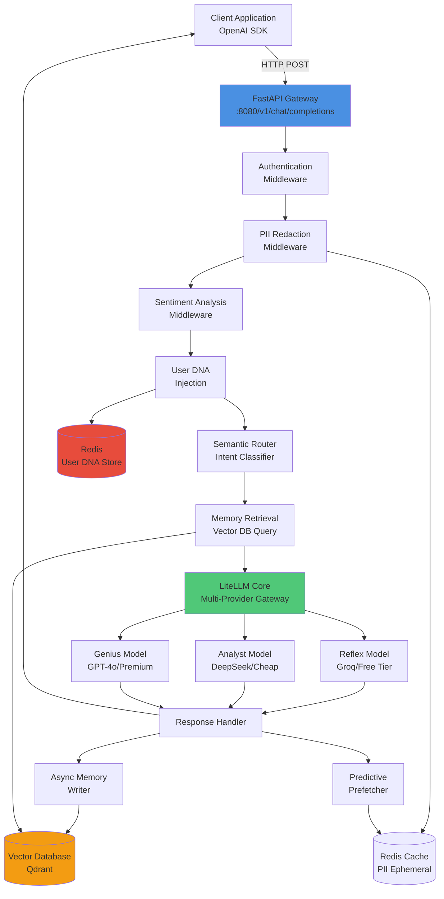
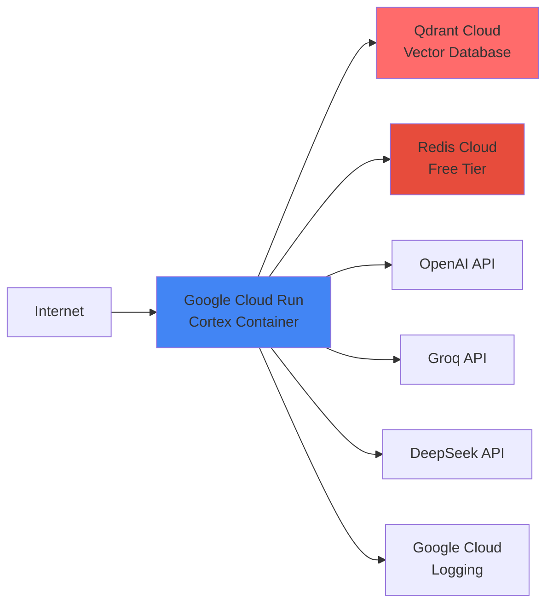

# Design Document

## Overview

Cortex is a FastAPI-based intelligent AI routing system that sits between client applications and multiple AI model providers. The system accepts standard OpenAI API requests and uses semantic analysis, cost optimization, and contextual memory to select and invoke the most appropriate model. The architecture is designed for deployment on Google Cloud Run with Docker containerization, utilizing LiteLLM as the core multi-provider gateway, a Vector Database (Qdrant) for shared memory, and Redis for fast key-value storage.

The system processes each request through a pipeline of middleware components:
1. Authentication and validation
2. PII detection and redaction
3. Sentiment analysis and circuit breaking
4. User DNA profile injection
5. Semantic routing and model selection
6. Memory retrieval and context augmentation
7. LiteLLM execution with fallback handling
8. Response post-processing and memory storage
9. Predictive prefetching for common workflows

## Architecture

### High-Level Architecture



### Deployment Architecture



## Components and Interfaces

### 1. FastAPI Application Core

**Responsibility:** HTTP server, request routing, middleware orchestration

**Interface:**
```python
@app.post("/v1/chat/completions")
async def chat_completions(request: ChatCompletionRequest) -> ChatCompletionResponse:
    """
    OpenAI-compatible chat completions endpoint.
    Accepts standard OpenAI request format and returns standard response.
    """
    pass

@app.get("/health")
async def health_check() -> dict:
    """Health check endpoint for Cloud Run."""
    return {"status": "healthy"}
```

**Dependencies:** FastAPI, Pydantic, uvicorn

### 2. Authentication Middleware

**Responsibility:** Validate KIRIO_CORTEX_MASTER_KEY from Authorization header

**Interface:**
```python
class AuthMiddleware:
    async def __call__(self, request: Request, call_next):
        """
        Validates Bearer token against master key.
        Returns 401 if invalid.
        """
        pass
```

**Configuration:** Reads `KIRIO_CORTEX_MASTER_KEY` from environment

### 3. PII Redaction Engine

**Responsibility:** Detect and redact sensitive information, store for re-insertion

**Interface:**
```python
class PIIRedactor:
    def redact(self, text: str) -> tuple[str, dict]:
        """
        Scans text for PII patterns and replaces with tokens.
        Returns (redacted_text, pii_mapping).
        """
        pass
    
    def restore(self, text: str, pii_mapping: dict) -> str:
        """
        Replaces tokens with original PII values.
        """
        pass
```

**Patterns Detected:**
- SSN: `\d{3}-\d{2}-\d{4}`
- Credit Card: `\d{4}[\s-]?\d{4}[\s-]?\d{4}[\s-]?\d{4}`
- Email: `[a-zA-Z0-9._%+-]+@[a-zA-Z0-9.-]+\.[a-zA-Z]{2,}`
- Phone: `\+?1?\d{10,14}`

**Storage:** Redis with 5-minute TTL using key pattern `pii:{request_id}`

### 4. Sentiment Analyzer

**Responsibility:** Analyze user message sentiment and trigger circuit breaker

**Interface:**
```python
class SentimentAnalyzer:
    def analyze(self, text: str) -> float:
        """
        Returns sentiment score from -1.0 (negative) to 1.0 (positive).
        Uses VADER sentiment analysis.
        """
        pass
    
    def should_override(self, score: float) -> bool:
        """
        Returns True if score <= -0.8 (high distress).
        """
        return score <= -0.8
```

**Library:** vaderSentiment (VADER)

### 5. Semantic Router

**Responsibility:** Classify prompt intent and select appropriate model tier

**Interface:**
```python
class SemanticRouter:
    def classify_intent(self, prompt: str) -> IntentCategory:
        """
        Classifies prompt into: Simple_Chat, Code_Gen, 
        Complex_Reasoning, or Creative_Story.
        """
        pass
    
    def select_model(self, category: IntentCategory, 
                     sentiment_override: bool = False) -> str:
        """
        Maps category to model name.
        Returns genius-model if sentiment_override is True.
        """
        pass
```

**Classification Strategy:**
- Use sentence-transformers library with `all-MiniLM-L6-v2` model
- Compute embeddings for prompt and category descriptions
- Select category with highest cosine similarity
- Fallback to GPT-3.5-Turbo API call if confidence < 0.6

**Model Mapping:**
```python
MODEL_MAPPING = {
    IntentCategory.SIMPLE_CHAT: "groq/llama-3.1-8b-instant",
    IntentCategory.CODE_GEN: "deepseek/deepseek-coder",
    IntentCategory.COMPLEX_REASONING: "gpt-4o",
    IntentCategory.CREATIVE_STORY: "claude-3-sonnet"
}
```

### 6. Memory Manager (The Librarian)

**Responsibility:** Store and retrieve cross-application context from Vector Database

**Interface:**
```python
class MemoryManager:
    def __init__(self, qdrant_client: QdrantClient):
        self.client = qdrant_client
        self.collection_name = "cortex_memory"
    
    async def retrieve_context(self, user_id: str, 
                               query: str, top_k: int = 3) -> list[str]:
        """
        Queries vector DB for relevant memories.
        Returns list of context strings.
        """
        pass
    
    async def store_memory(self, user_id: str, 
                           conversation: dict, summary: str):
        """
        Embeds and stores distilled memory with metadata.
        """
        pass
    
    def _embed_text(self, text: str) -> list[float]:
        """
        Generates embedding using sentence-transformers.
        """
        pass
```

**Vector Database Schema:**
```python
{
    "id": "uuid",
    "vector": [768 dimensions],  # all-MiniLM-L6-v2 embeddings
    "payload": {
        "user_id": "string",
        "summary": "string",
        "timestamp": "iso8601",
        "source_app": "string",
        "conversation_turn": "string"
    }
}
```

**Summarization:** Use `gpt-3.5-turbo` with prompt:
```
Distill the following conversation into a single factual statement about the user's preferences, context, or current work. Be concise and specific.

Conversation:
{conversation}

Fact:
```

### 7. User DNA Manager

**Responsibility:** Load and inject user preference profiles

**Interface:**
```python
class UserDNAManager:
    def __init__(self, redis_client: Redis):
        self.redis = redis_client
    
    async def get_profile(self, user_id: str) -> UserDNAProfile:
        """
        Retrieves profile from Redis or returns default.
        """
        pass
    
    def format_system_prompt(self, profile: UserDNAProfile) -> str:
        """
        Formats profile as system prompt directives.
        """
        return f"""
        [USER PROFILE]
        Communication Style: {profile.style}
        Preferred Tone: {profile.tone}
        Technical Level: {profile.skill_level}
        [END PROFILE]
        """
```

**Profile Schema:**
```python
@dataclass
class UserDNAProfile:
    style: str  # "concise", "detailed", "conversational"
    tone: str   # "professional", "casual", "friendly"
    skill_level: str  # "beginner", "intermediate", "expert"
    preferences: dict  # Additional key-value preferences
```

**Storage:** Redis key pattern `user_dna:{user_id}` with JSON serialization

### 8. LiteLLM Integration Layer

**Responsibility:** Execute model calls with fallback handling

**Interface:**
```python
class LiteLLMExecutor:
    def __init__(self):
        self.config = self._load_config()
        litellm.set_verbose = False
    
    async def complete(self, messages: list[dict], 
                       model: str, **kwargs) -> dict:
        """
        Calls litellm.acompletion with fallback configuration.
        Logs latency and success/failure.
        """
        pass
    
    def _load_config(self) -> dict:
        """
        Loads model list and fallback configuration.
        """
        pass
```

**LiteLLM Config (config.yaml):**
```yaml
model_list:
  - model_name: reflex-model
    litellm_params:
      model: groq/llama-3.1-8b-instant
      api_key: os.environ/GROQ_API_KEY
    fallbacks:
      - model: gpt-3.5-turbo
        api_key: os.environ/OPENAI_API_KEY
  
  - model_name: analyst-model
    litellm_params:
      model: deepseek/deepseek-coder
      api_key: os.environ/DEEPSEEK_API_KEY
    fallbacks:
      - model: gpt-3.5-turbo
  
  - model_name: genius-model
    litellm_params:
      model: gpt-4o
      api_key: os.environ/OPENAI_API_KEY
    fallbacks:
      - model: claude-3-sonnet
        api_key: os.environ/ANTHROPIC_API_KEY
```

### 9. Predictive Prefetcher

**Responsibility:** Identify workflow patterns and prepare follow-up responses

**Interface:**
```python
class PredictivePrefetcher:
    WORKFLOW_PATTERNS = {
        "plan_trip": ["generate itinerary", "suggest hotels"],
        "book_meeting": ["draft meeting summary", "create agenda"],
        "draft_email": ["suggest subject lines", "format signature"]
    }
    
    async def detect_workflow(self, prompt: str) -> Optional[str]:
        """
        Detects workflow keywords in prompt.
        """
        pass
    
    async def prefetch_async(self, workflow: str, context: dict):
        """
        Executes background task to prepare follow-up.
        Stores result in Redis with 10-minute TTL.
        """
        pass
```

**Cache Key Pattern:** `prefetch:{user_id}:{workflow}:{hash(context)}`

### 10. Logging and Observability

**Responsibility:** Track metrics, errors, and performance

**Interface:**
```python
class CortexLogger:
    def log_request(self, request_id: str, user_id: str, 
                    model: str, latency_ms: float, success: bool):
        """
        Logs request metrics to Google Cloud Logging.
        """
        pass
    
    def log_fallback(self, request_id: str, primary_model: str, 
                     fallback_model: str, reason: str):
        """
        Logs fallback events.
        """
        pass
```

**Metrics Tracked:**
- Request latency (p50, p95, p99)
- Model selection distribution
- Fallback frequency
- PII redaction count
- Sentiment override frequency
- Cache hit rate (prefetch)
- Memory retrieval relevance scores

## Data Models

### Request Flow Data

```python
@dataclass
class CortexRequest:
    request_id: str
    user_id: str
    original_messages: list[dict]
    augmented_messages: list[dict]  # After context injection
    selected_model: str
    intent_category: IntentCategory
    sentiment_score: float
    pii_mapping: dict
    user_dna: UserDNAProfile
    retrieved_context: list[str]
    timestamp: datetime

@dataclass
class CortexResponse:
    request_id: str
    model_used: str
    fallback_occurred: bool
    latency_ms: float
    response_content: str
    tokens_used: int
    cost_estimate: float
```

### Memory Data

```python
@dataclass
class MemoryEntry:
    id: str
    user_id: str
    summary: str
    embedding: list[float]
    source_app: str
    timestamp: datetime
    conversation_snippet: str
    relevance_score: float  # Computed during retrieval
```

## Correctness Properties

*A property is a characteristic or behavior that should hold true across all valid executions of a system—essentially, a formal statement about what the system should do. Properties serve as the bridge between human-readable specifications and machine-verifiable correctness guarantees.*


### Property 1: Valid requests are accepted
*For any* properly formatted OpenAI ChatCompletion request, the Cortex should accept it and return a valid response (not a 400 or 404 error for format issues).
**Validates: Requirements 1.1**

### Property 2: Authentication validates tokens correctly
*For any* bearer token, the Cortex should accept the request if and only if the token matches the KIRIO_CORTEX_MASTER_KEY, returning 401 for all other tokens.
**Validates: Requirements 1.2, 1.3**

### Property 3: Valid requests reach LiteLLM
*For any* authenticated and valid request, the Cortex should forward the request to the LiteLLM gateway for processing.
**Validates: Requirements 1.4**

### Property 4: Intent classification produces valid categories
*For any* user prompt, the semantic router should classify it into exactly one of the defined categories: Simple_Chat, Code_Gen, Complex_Reasoning, or Creative_Story.
**Validates: Requirements 2.1**

### Property 5: Category-to-model routing is consistent
*For any* classified prompt (without sentiment override), the Cortex should route Simple_Chat to Reflex Model, Code_Gen to Analyst Model, and Complex_Reasoning to Genius Model consistently.
**Validates: Requirements 2.2, 2.3, 2.4**

### Property 6: Model parameter is overwritten
*For any* request with an initial model parameter, the Cortex should replace it with the router-selected model before forwarding to LiteLLM.
**Validates: Requirements 2.5**

### Property 7: Memory retrieval occurs for user requests
*For any* request containing a user_id, the Cortex should query the Vector Database for relevant memories associated with that user_id.
**Validates: Requirements 3.1**

### Property 8: Memory retrieval returns bounded results
*For any* memory query, the Cortex should return at most 3 context items, even if more relevant memories exist.
**Validates: Requirements 3.2**

### Property 9: Retrieved context is injected into prompts
*For any* non-empty set of retrieved memories, all retrieved context items should appear in the system prompt sent to the LLM.
**Validates: Requirements 3.3**

### Property 10: Memory storage is triggered for responses
*For any* successful AI response, the Cortex should asynchronously initiate memory storage processing.
**Validates: Requirements 3.4**

### Property 11: Memories are summarized before storage
*For any* memory storage operation, the conversation should be processed through a summarizer model before embedding and storage.
**Validates: Requirements 3.5**

### Property 12: Stored memories have required metadata
*For any* memory entry stored in the Vector Database, it should contain user_id, timestamp, embedding vector, and summary text.
**Validates: Requirements 3.6**

### Property 13: Fallback is attempted on primary failure
*For any* primary model request that fails, the Cortex should automatically attempt the request with the configured fallback model.
**Validates: Requirements 4.1**

### Property 14: Fallback attempts are logged
*For any* fallback attempt, the Cortex should create a log entry containing latency and success/failure status.
**Validates: Requirements 4.2**

### Property 15: Fallback responses hide implementation details
*For any* successful fallback response, the response should not contain metadata about which fallback model was used or that fallback occurred.
**Validates: Requirements 4.5**

### Property 16: User DNA profiles are retrieved
*For any* request with a user_id, the Cortex should query the key-value store for the User DNA Profile.
**Validates: Requirements 5.1**

### Property 17: DNA profiles are injected when present
*For any* request where a User DNA Profile exists, the profile attributes (style, tone, skill_level) should appear in the system prompt.
**Validates: Requirements 5.2, 5.4**

### Property 18: DNA profile updates are persisted
*For any* User DNA Profile update operation, the new profile should be stored in the key-value store and retrievable in subsequent requests.
**Validates: Requirements 5.5**

### Property 19: PII is redacted with tokens
*For any* prompt containing PII patterns (SSN, credit card, email, phone), the sensitive data should be replaced with placeholder tokens before sending to the LLM.
**Validates: Requirements 6.2**

### Property 20: Redacted PII is cached
*For any* PII redaction operation, the original PII values should be stored in the ephemeral cache with the request_id as the key.
**Validates: Requirements 6.3**

### Property 21: PII round-trip restoration
*For any* redacted PII that appears as a placeholder token in the AI response, the Cortex should restore it to the original value before returning to the client.
**Validates: Requirements 6.5**

### Property 22: Sentiment analysis is performed
*For any* user message, the Cortex should compute a sentiment score using the sentiment analyzer.
**Validates: Requirements 7.1**

### Property 23: High distress triggers genius routing
*For any* message with sentiment score <= -0.8, the Cortex should override standard routing and select the Genius Model regardless of the classified intent category.
**Validates: Requirements 7.2, 7.3**

### Property 24: Sentiment overrides are logged
*For any* sentiment-based routing override, the Cortex should create a log entry containing the sentiment score and override decision.
**Validates: Requirements 7.5**

### Property 25: Workflow keywords trigger detection
*For any* prompt containing workflow keywords (plan trip, book meeting, draft email), the Cortex should identify the corresponding workflow pattern.
**Validates: Requirements 8.1**

### Property 26: Detected workflows initiate prefetch tasks
*For any* identified workflow pattern, the Cortex should create an asynchronous background task to prepare the likely follow-up response.
**Validates: Requirements 8.2**

### Property 27: Prefetch results are cached
*For any* completed prefetch task, the result should be stored in Redis cache with an appropriate TTL.
**Validates: Requirements 8.3**

### Property 28: Cache hits return immediately
*For any* request that matches a cached prefetch entry, the Cortex should return the cached result without invoking the LLM.
**Validates: Requirements 8.4**

### Property 29: Prefetch failures are isolated
*For any* prefetch task failure, the primary request response should be unaffected and returned successfully.
**Validates: Requirements 8.5**

## Error Handling

### Authentication Errors
- **401 Unauthorized**: Invalid or missing KIRIO_CORTEX_MASTER_KEY
- **Response Format**: `{"error": {"message": "Invalid authentication", "type": "auth_error", "code": "invalid_api_key"}}`

### Validation Errors
- **400 Bad Request**: Malformed request body or missing required fields
- **Response Format**: `{"error": {"message": "Invalid request format", "type": "invalid_request_error", "param": "messages"}}`

### Model Execution Errors
- **500 Internal Server Error**: All fallback models failed
- **Response Format**: `{"error": {"message": "All model providers unavailable", "type": "api_error", "code": "service_unavailable"}}`
- **Retry Strategy**: Client should implement exponential backoff

### Rate Limiting
- **429 Too Many Requests**: Rate limit exceeded (if implemented)
- **Headers**: `X-RateLimit-Limit`, `X-RateLimit-Remaining`, `X-RateLimit-Reset`

### Timeout Handling
- **Request Timeout**: 30 seconds for standard requests, 60 seconds for complex reasoning
- **Behavior**: Return partial response if available, otherwise 504 Gateway Timeout

### Vector Database Errors
- **Fallback**: If Vector DB is unavailable, proceed without memory context
- **Logging**: Log warning but don't fail the request
- **Retry**: Attempt reconnection on next request

### Redis Errors
- **User DNA**: Use default profile if Redis is unavailable
- **PII Cache**: Skip restoration if cache miss (log warning)
- **Prefetch Cache**: Proceed with normal LLM call if cache unavailable

## Testing Strategy

### Unit Testing

The system will use **pytest** as the primary testing framework with the following structure:

**Test Organization:**
```
tests/
├── unit/
│   ├── test_auth_middleware.py
│   ├── test_pii_redactor.py
│   ├── test_sentiment_analyzer.py
│   ├── test_semantic_router.py
│   ├── test_memory_manager.py
│   ├── test_user_dna_manager.py
│   └── test_predictive_prefetcher.py
├── integration/
│   ├── test_request_pipeline.py
│   ├── test_litellm_integration.py
│   └── test_vector_db_integration.py
└── property/
    └── test_cortex_properties.py
```

**Unit Test Coverage:**
- Authentication middleware with valid/invalid tokens
- PII pattern detection for each PII type (SSN, credit card, email, phone)
- Sentiment analysis with known positive/negative/neutral texts
- Intent classification with example prompts for each category
- Memory embedding and retrieval with mock Vector DB
- User DNA profile serialization and formatting
- Workflow keyword detection

**Mocking Strategy:**
- Mock external services (OpenAI, Groq, DeepSeek) using `pytest-mock`
- Mock Redis using `fakeredis`
- Mock Qdrant using in-memory client
- Mock LiteLLM completion calls for isolated testing

### Property-Based Testing

The system will use **Hypothesis** for property-based testing to verify universal properties across random inputs.

**Configuration:**
- Minimum 100 iterations per property test
- Use `@given` decorators with custom strategies
- Tag each test with the property number from this design document

**Property Test Implementation:**

Each property-based test MUST:
1. Be tagged with a comment: `# Feature: cortex-ai-router, Property {N}: {property_text}`
2. Use Hypothesis strategies to generate random valid inputs
3. Run for at least 100 iterations
4. Verify the property holds for all generated inputs

**Example Property Test Structure:**
```python
from hypothesis import given, strategies as st

# Feature: cortex-ai-router, Property 2: Authentication validates tokens correctly
@given(token=st.text())
def test_authentication_property(token):
    """For any bearer token, accept if matches master key, reject otherwise."""
    response = client.post(
        "/v1/chat/completions",
        headers={"Authorization": f"Bearer {token}"},
        json=valid_request_body
    )
    if token == MASTER_KEY:
        assert response.status_code != 401
    else:
        assert response.status_code == 401
```

**Custom Strategies:**
- `openai_request()`: Generates valid OpenAI ChatCompletion requests
- `user_prompt()`: Generates realistic user prompts with various intents
- `pii_text()`: Generates text containing various PII patterns
- `sentiment_text(min_score, max_score)`: Generates text with target sentiment
- `user_dna_profile()`: Generates valid User DNA Profile objects

**Property Test Coverage:**
- All 29 correctness properties defined in this document
- Focus on invariants, round-trip properties, and boundary conditions
- Test error conditions with invalid inputs

### Integration Testing

**End-to-End Request Flow:**
- Test complete request pipeline from authentication to response
- Verify middleware execution order
- Test with real Redis and Qdrant instances (test containers)
- Validate LiteLLM integration with mock providers

**Performance Testing:**
- Measure p95 latency for each model tier
- Test concurrent request handling (100+ simultaneous requests)
- Verify memory leak prevention with long-running tests
- Test cache hit rates for prefetching

**Deployment Testing:**
- Build Docker container and verify startup
- Test environment variable loading
- Verify health check endpoint
- Test graceful shutdown

## Implementation Notes

### Technology Stack
- **Python**: 3.11+
- **Web Framework**: FastAPI 0.104+
- **LLM Gateway**: LiteLLM 1.0+
- **Vector Database**: Qdrant Cloud (free tier) or ChromaDB
- **Cache/KV Store**: Redis Cloud (free tier) or Upstash
- **Embeddings**: sentence-transformers (all-MiniLM-L6-v2)
- **Sentiment Analysis**: vaderSentiment
- **Testing**: pytest, hypothesis, pytest-mock, fakeredis
- **Deployment**: Docker, Google Cloud Run
- **Logging**: structlog with Google Cloud Logging integration

### Performance Targets
- **P95 Latency**: < 2 seconds for reflex-model, < 5 seconds for genius-model
- **Memory Retrieval**: < 100ms for Vector DB query
- **PII Redaction**: < 50ms for pattern matching
- **Sentiment Analysis**: < 30ms per message
- **Intent Classification**: < 200ms using local model

### Security Considerations
- All API keys stored as environment variables, never in code
- PII cache uses short TTL (5 minutes) and encrypted at rest
- Master key validated using constant-time comparison
- Rate limiting per user_id to prevent abuse
- Input validation to prevent injection attacks
- CORS configuration for allowed origins only

### Scalability Considerations
- Stateless design allows horizontal scaling on Cloud Run
- Redis and Qdrant can scale independently
- Async memory operations prevent blocking
- Connection pooling for database clients
- Caching reduces redundant LLM calls

### Cost Optimization
- Semantic routing minimizes expensive model usage
- Prefetching reduces duplicate requests
- Fallback to cheaper models when premium unavailable
- Cloud Run scales to zero when idle
- Free tiers for Redis and Qdrant during development
